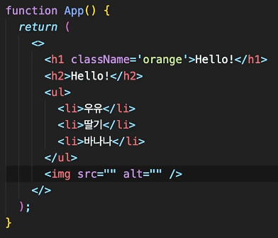
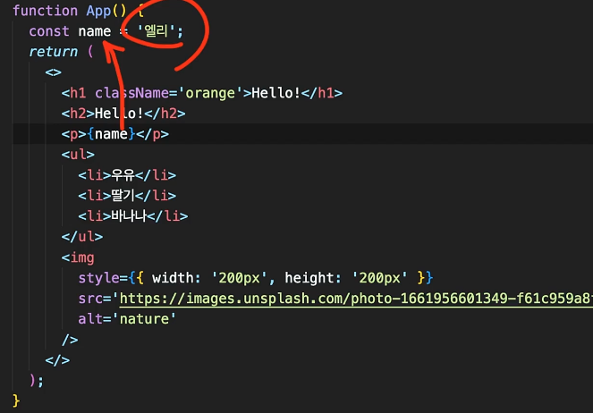
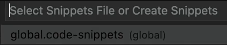

### 4.4 JSX 문법 정리 (기본)

- 다수의 태그를 반환하고 싶다면, 하나의 태그를 반환하기 (부모의 태그로 감싸주기) ( `<>` `</>`)
  

- HTML은 `class`, JS는 `className`을 사용해야함

- JS는 중괄호 사용하기
  

- react에서 컴포넌트를 표현할때 함수로 만들수 있음 App()

- 컴포넌트를 표현할때 return 할 때 jsx문법 사용하기

### 4.7 컴포넌트 만드는 꿀팁

명령어 팔레트(command + shift + p)에서 커스텀 컴포넌트 만들기



```
{
  "reactFunction": {
    "prefix": "rfc",
    "body": "import React from 'react';\n\nexport default function ${1:${TM_FILENAME_BASE}}() {\n\treturn (\n\t\t\u003Cdiv\u003E\n\t\t\t\n\t\t\u003C/div\u003E\n\t);\n}\n\n",
    "description": "Creates a React Function component"
  },
  // return없이 ()로 바로 값을 리턴해줌
  "reactStatelessImplicitReturn": {
    "prefix": "rsi",
    "body": "import React from 'react';\n\nexport const ${1:${TM_FILENAME_BASE}} = (props) =\u003E (\n\t\t\t$0\n\t);",
    "description": "Creates a React Function component"
  },
  "Import Module CSS": {
    "prefix": "si",
    "body": [
      "import styles from './$TM_FILENAME_BASE.module.css'"
    ],
    "description": "Import PostCSS"
  },
  "ClassName": {
    "prefix": "cn",
    "body": [
      "className={styles.$1}"
    ],
    "description": "Adding className"
  }
}
```

### 4.15 내부 상태관리 State

리액트에서 변경 가능한 상태는 useState를 써야하고, 내부상태는 useState를 통해서 간직하고 업데이트 해야한다
const [count, setCount] = useState(0);

> const [count, setCount] = useState(0);

> const [값을 가리키고 있는 변수, 업데이트할 수 있는 함수 ] useState(초기값);
